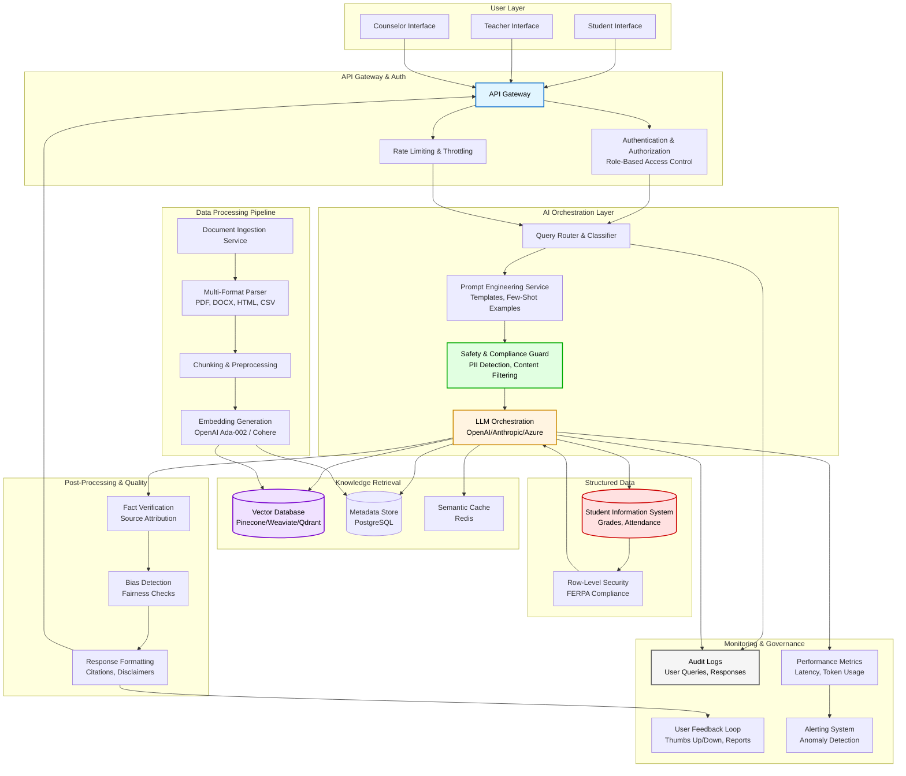

# AI Knowledge Assistant - System Architecture

## High-Level Architecture Diagram

## Architecture Components Overview

### 1. User Layer
- **Role-based interfaces** for students, teachers, and counselors
- Different access levels and query capabilities per role
- Responsive web interface with conversational UI

### 2. API Gateway & Authentication
- **API Gateway**: Single entry point, request routing
- **Authentication**: SSO integration (SAML/OAuth), session management
- **Authorization**: Role-Based Access Control (RBAC)
- **Rate Limiting**: Prevent abuse, manage costs

### 3. AI Orchestration Layer
- **Query Router**: Classifies queries (e.g., "needs student data" vs "curriculum info")
- **Prompt Engineering Service**: Dynamic template selection, context injection
- **Safety Guard**: Pre-flight checks for PII, inappropriate content
- **LLM Orchestration**: Manages calls to foundation models, handles retries

### 4. Data Processing Pipeline
- **Document Ingestion**: Scheduled/triggered uploads from various sources
- **Multi-Format Parser**: Handles PDFs, Word docs, HTML, structured data
- **Chunking Strategy**: Smart chunking with overlap, metadata preservation
- **Embedding Generation**: Convert chunks to vectors for semantic search

### 5. Knowledge Retrieval
- **Vector Database**: Fast similarity search across embedded documents
- **Metadata Store**: Document metadata, access controls, versioning
- **Semantic Cache**: Cache similar queries to reduce cost/latency

### 6. Structured Data Layer
- **Student Information System**: Integration with existing SIS
- **Row-Level Security**: FERPA-compliant access controls
- **Query Translation**: Natural language to SQL/API calls

### 7. Post-Processing & Quality
- **Fact Verification**: Ground-truth checking, source attribution
- **Bias Detection**: Identify and flag potentially biased responses
- **Response Formatting**: Add citations, disclaimers, confidence scores

### 8. Monitoring & Governance
- **Audit Logs**: Complete query/response history for compliance
- **Performance Metrics**: Latency, accuracy, user satisfaction
- **Feedback Loop**: User ratings feed into model improvement
- **Alerting**: Proactive detection of issues (quality drops, attacks)

## Design Principles

### Scalability
- **Horizontal scaling**: Microservices architecture allows independent scaling
- **Async processing**: Background jobs for document ingestion
- **Caching layers**: Reduce redundant LLM calls
- **Load balancing**: Distribute traffic across multiple instances

### Reliability
- **Circuit breakers**: Prevent cascade failures
- **Fallback strategies**: Graceful degradation when services unavailable
- **Retry logic**: Handle transient failures
- **Multi-model support**: Fallback to alternative LLMs if primary fails

### Governance
- **Audit trail**: Every query logged with user context
- **Access controls**: Fine-grained permissions at document/data level
- **Bias monitoring**: Continuous evaluation of response fairness
- **Version control**: Track prompt templates, model versions
- **FERPA compliance**: Strict data access controls, encryption at rest/transit

