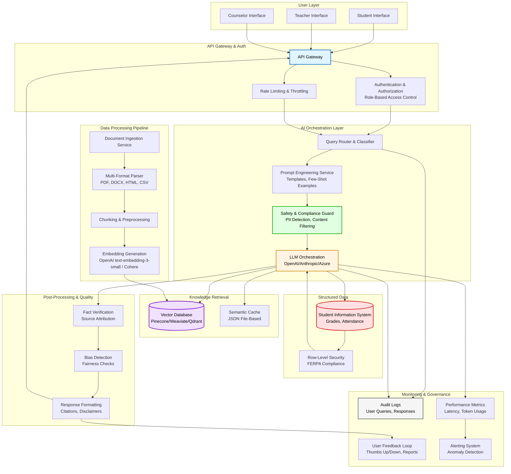

# How to Export Mermaid Diagram to PDF/Image

Your Mermaid diagram in `ARCHITECTURE.md` looks great! Here are several ways to convert it to PDF or image format.

## Option 1: Mermaid Live Editor (Easiest - No Installation)

**Best for**: Quick export, no setup required

1. Go to https://mermaid.live/
2. Copy the Mermaid code from `ARCHITECTURE.md` (lines 7-100)
3. Paste into the editor
4. Click **"Actions"** → **"Download PNG"** or **"Download SVG"**
5. For PDF: Download SVG, then convert SVG to PDF using any online converter

**Pros**:
- ✅ No installation needed
- ✅ Works immediately
- ✅ High quality output

**Cons**:
- ⚠️ Need to copy/paste code manually

---

## Option 2: Mermaid CLI (Best Quality - Requires Node.js)

**Best for**: Automated exports, batch processing

### Installation:
```bash
npm install -g @mermaid-js/mermaid-cli
```

### Usage:
```bash
# Export to PNG
mmdc -i ARCHITECTURE.md -o architecture-diagram.png -b transparent

# Export to PDF (via SVG)
mmdc -i ARCHITECTURE.md -o architecture-diagram.svg
# Then convert SVG to PDF using Inkscape or online tool

# Export specific diagram from markdown
# (You'll need to extract just the mermaid code block)
```

**Pros**:
- ✅ High quality
- ✅ Can automate
- ✅ Supports multiple formats

**Cons**:
- ⚠️ Requires Node.js installation

---

## Option 3: VS Code Extension (If You Use VS Code)

**Best for**: Export directly from editor

1. Install extension: **"Markdown Preview Mermaid Support"** or **"Mermaid Preview"**
2. Open `ARCHITECTURE.md` in VS Code
3. Right-click on the preview → **"Export to PDF"** or take screenshot

**Pros**:
- ✅ Works in your editor
- ✅ No external tools needed

**Cons**:
- ⚠️ Requires VS Code extension

---

## Option 4: Pandoc (For Full Document Export)

**Best for**: Converting entire markdown file to PDF with diagram

### Installation:
```bash
# Install Pandoc
# Download from: https://pandoc.org/installing.html

# Install mermaid filter
pip install pandoc-mermaid-filter
```

### Usage:
```bash
pandoc ARCHITECTURE.md -o architecture.pdf --filter pandoc-mermaid
```

**Pros**:
- ✅ Converts entire document
- ✅ Includes diagram in context

**Cons**:
- ⚠️ More complex setup

---

## Option 5: Browser Screenshot (Quick & Dirty)

**Best for**: Fast, no tools needed

1. Open `ARCHITECTURE.md` in GitHub (if you have it in a repo)
2. Or use a markdown previewer that supports Mermaid
3. Take a screenshot of the rendered diagram
4. Crop and save

**Pros**:
- ✅ No installation
- ✅ Works immediately

**Cons**:
- ⚠️ Lower quality
- ⚠️ Manual cropping needed

---

## Option 6: Online Markdown to PDF Converters

**Best for**: Converting entire document

1. **Markdown to PDF**: https://www.markdowntopdf.com/
2. **Dillinger**: https://dillinger.io/ (supports Mermaid)
3. **StackEdit**: https://stackedit.io/ (supports Mermaid)

**Steps**:
1. Copy your markdown content
2. Paste into the online editor
3. Export to PDF

**Pros**:
- ✅ No installation
- ✅ Converts full document

**Cons**:
- ⚠️ May not render Mermaid perfectly
- ⚠️ Privacy concerns (uploading content)

---

## Recommended Approach

**For best results, I recommend Option 1 (Mermaid Live Editor)**:

1. Go to https://mermaid.live/
2. Copy this code block from `ARCHITECTURE.md`:



3. Paste into https://mermaid.live/
4. Click **"Actions"** → **"Download PNG"** (for image) or **"Download SVG"** (for vector, can convert to PDF)

---

## Quick Script Option (If You Have Node.js)

I can create a simple script to automate this. Would you like me to create a Node.js script that extracts the Mermaid diagram and converts it to PNG/PDF?


